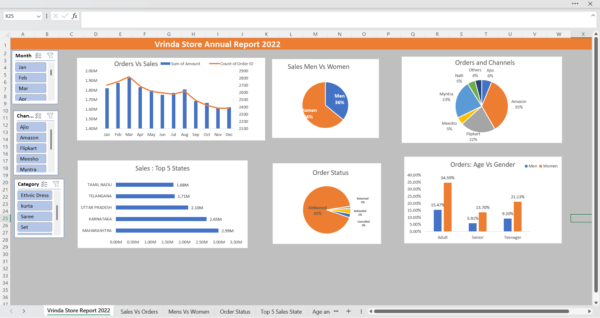

# Sales Analysis Using Excel: Vrinda Store (2022)

##📊 Overview
This analysis provides detailed insights into the sales and orders of Vrinda Store for 2022. It identifies key customer segments, geographic performance, and actionable strategies to boost sales.

##🔍 Key Objectives

Compare sales and orders on a single chart.
Identify top-performing months for sales and orders.
Analyze purchasing patterns by gender and age group.
Discover top contributing states and sales channels.
Uncover highest-selling categories and trends.
